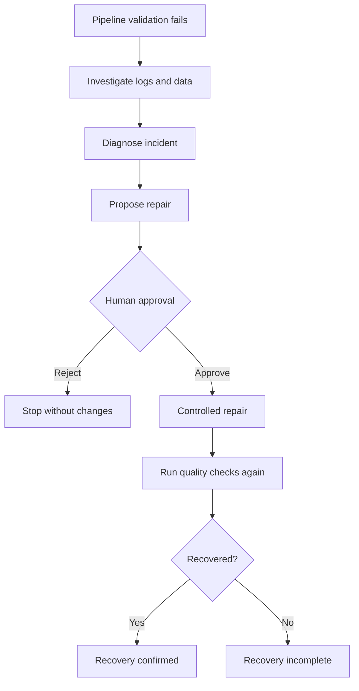

# Pipeline Recovery Agent

A human-in-the-loop LangGraph agent that investigates and safely repairs common data-pipeline failures.

The project uses a small orders pipeline and three controlled incidents: schema drift, duplicate IDs, and missing values. When validation fails, the agent inspects the logs and DuckDB table, diagnoses the likely cause, proposes a repair, and pauses for human approval. Only predefined Python operations can modify the data; the LLM never writes or executes arbitrary SQL.

## Workflow



## Safety design

- Pydantic validates diagnoses, repair plans, approval decisions, and results.
- The LLM can choose only from supported repair actions.
- Regular Python validates every action and parameter before execution.
- SQL values are parameterized and write operations run in transactions.
- LangGraph `interrupt()` pauses execution for human approval.
- SQLite checkpoints allow an incident to resume after Python restarts.
- Quality checks run again after every approved repair.

## Project structure

| File | Responsibility |
| --- | --- |
| `main.py` | Command-line entry point and approval interaction |
| `agent.py` | LangGraph state, nodes, routing, persistence and recovery validation |
| `tools.py` | Read-only investigation tools and controlled repair operations |
| `pipeline.py` | CSV loading, DuckDB transformation and pipeline logging |
| `validation.py` | Deterministic schema, duplicate and missing-value checks |
| `models.py` | Pydantic data contracts |
| `prompts.py` | Diagnosis and repair-planning prompts |
| `incidents.py` | Generation of the three faulty datasets |
| `test_agent.py` | Deterministic workflow tests with a fake LLM |
| `langgraph.json` | Local LangSmith Studio configuration |

## Setup

Create and activate a virtual environment, then install the dependencies:

```bash
python -m venv venv

# Windows
venv\Scripts\activate

# macOS/Linux
source venv/bin/activate

pip install -r requirements.txt
```

Copy `.env.example` to `.env` and add your API keys.

## Run the project

Run the clean pipeline:

```bash
python main.py
```

Run an incident:

```bash
python main.py --incident duplicates
python main.py --incident schema_drift
python main.py --incident missing_values
```

To test recovery after a process restart, use a known thread ID and enter `later` at the approval prompt:

```bash
python main.py --incident duplicates --thread-id incident-001
python main.py --resume incident-001
```

## Tests

The tests use temporary DuckDB databases and a fake structured-output model. They make no OpenAI calls and do not modify the project database.

```bash
pytest -q
```

The nine cases cover approval, rejection, every supported repair, invalid parameters, an incorrect diagnosis, and successful or incomplete recovery.

## LangSmith and Studio

Set the LangSmith variables in `.env` to trace prompts, model responses, node transitions, tool calls, errors, and latency.

To open the graph visualization locally:

```bash
pip install -U "langgraph-cli[inmem]"
langgraph dev --allow-blocking
```

Open the Studio URL printed in the terminal.

## Built with

Python, LangGraph, DuckDB, SQL, Pydantic, OpenAI and LangSmith.
